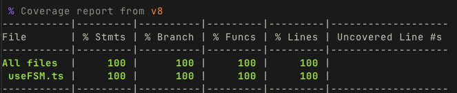

# useFSM

A dead simple finite state machine hook for React.

## Installation

It's recommended to just copy the [useFSM.ts](https://github.com/geoffmiller/use-fsm/blob/main/useFSM.ts) into your codebase. 

Copy the [useFSM.test.ts](https://github.com/geoffmiller/use-fsm/blob/main/useFSM.test.ts) test file as well if you are using vitest/react-testing-library

## Usage

`useFSM` is a React hook that implements a simple finite state machine. It allows you to define states and transitions between them, making it easier to manage complex state logic in your components.

```tsx
import { useFSM } from "usefsm";

function MyComponent() {
  const { state, send, is } = useFSM("idle", {
    idle: {
      FETCH: "loading",
    },
    loading: {
      SUCCESS: "success",
      ERROR: "error",
    },
    error: {
      RETRY: "loading",
    },
    success: {
      REFRESH: "loading",
    },
  });

  const fetchData = () => {
    send("FETCH");
    fetch("/api/data")
      .then((response) => {
        if (response.ok) {
          send("SUCCESS");
        } else {
          send("ERROR");
        }
      })
      .catch(() => {
        send("ERROR");
      });
  };

  return (
    <div>
      <div>Current state: {state}</div>

      {is("idle") && <button onClick={fetchData}>Fetch Data</button>}

      {is("loading") && <div>Loading...</div>}

      {is("error") && (
        <div>
          <div>An error occurred</div>
          <button onClick={fetchData}>Retry</button>
        </div>
      )}

      {is("success") && (
        <div>
          <div>Data loaded successfully!</div>
          <button onClick={() => send("REFRESH")}>Refresh</button>
        </div>
      )}
    </div>
  );
}
```

## API

### `useFSM<S, E>(initialState: S, transitions: TransitionMap<S, E>)`

Creates a finite state machine with the given initial state and transition mapping.

#### Parameters

- `initialState`: The starting state of the machine.
- `transitions`: A map of transitions between states, keyed by current state. Each state maps to a record of events that can transition to other states.

#### Return Value

An object containing:

- `state`: The current state of the machine.
- `send(event: E)`: A function to send events to the state machine. Returns `true` if the transition was successful, `false` otherwise.
- `is(state: S)`: A helper function that returns `true` if the current state matches the given state.

### Advanced Usage with Guards

You can add guards to transitions to conditionally prevent transitions:

```tsx
const { state, send } = useFSM("inactive", {
  inactive: {
    ACTIVATE: {
      target: "active",
      guard: () => user.hasPermission("activate"),
    },
  },
  active: {
    DEACTIVATE: "inactive",
  },
});
```

## TypeScript Support

`useFSM` is fully typed and will enforce correct state and event types:

```tsx
type AppState = "idle" | "loading" | "success" | "error";
type AppEvent = "FETCH" | "SUCCESS" | "ERROR" | "RETRY" | "REFRESH";

const { state, send, is } = useFSM<AppState, AppEvent>("idle", {
  idle: { FETCH: "loading" },
  // ...
});
```

## Test Coverage

## Test Coverage



## License

MIT
